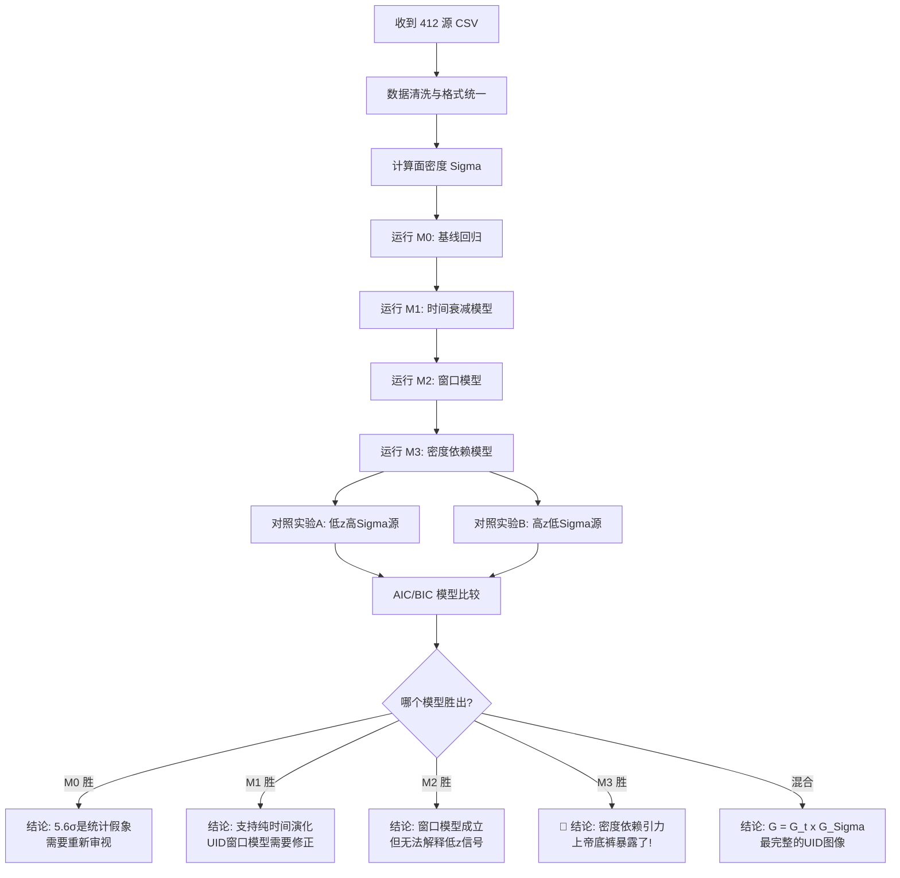

# 412 LRD 源三模型竞技计划

> **目标**：拿到 Rinaldi et al. 的 412 个 JADES LRD 源后，通过模型比较区分三种引力异常机制
> **创建日期**：2026-04-16  
> **状态**：📋 等待数据释放（Rinaldi 论文 arXiv:2604.07138 已投稿 ApJ，数据未公开）
> **前置条件**：第一篇 MNRAS 发表（作为"入场券"正式联系合作）

---

## 背景

### Rinaldi 论文信息
| 项目 | 详情 |
|------|------|
| 标题 | *The Way We Tally Becomes the Tale: the Impact of Selection Strategies on the Inferred Evolution of Little Red Dots Across Cosmic Time* |
| 第一作者 | **Pierluigi Rinaldi** (STScI, prinaldi@stsci.edu) |
| 合作者 | 30 位（含 Hainline, D'Eugenio, Pérez-González, Eisenstein 等） |
| arXiv | **2604.07138**（2026-04-08 发布） |
| 投稿期刊 | ApJ（已投稿，尚未接收） |
| 样本规模 | **412 个 LRD 源**（JADES GOODS-N/S） |
| 红移范围 | **z ≈ 2 – 11** |
| 面积 | ~349.6 arcmin² |
| 核心论点 | 传统 color cuts 选漏了 >75% 的 LRDs；LRDs 是连续体而非单一天体类型 |

### 数据可用性
- ❌ 当前未公开（arXiv 无数据链接，VizieR/CDS/Zenodo 均未收录）
- 邮件已发索取数据（2026-04-16），等待回复
- 预计数据公开时间线：ApJ 接收后 → CDS/VizieR 收录 MRT（约 2-3 个月）

### 与现有工作的关系
| 项目 | 样本 | 红移范围 | 核心发现 |
|------|------|---------|---------|
| 已投 ApJL (AAS76108) | Kokorev 260 源 | z = 4–9 | F444W/F150W vs Σ: ρ_p = +0.341 (**5.6σ**) |
| 本计划 | **Rinaldi 412 源** | **z = 2–11** | 三模型区分 + G(Σ) vs G(t) 判定 |

**412 源的关键优势**：
1. **红移范围更宽**（下延到 z=2 → 可以分离时间效应和密度效应）
2. **样本量增加 58%**（统计功效显著提升）
3. **JADES 官方团队数据**（更可靠、更完整的光度/结构参数）

---

## 三种竞争模型

### 模型 M0：ΛCDM 基线（零假设 H₀）

$$\text{Color} = \alpha_0 + \alpha_1 z + \alpha_2 \log M_* + \alpha_3 A_V + \epsilon$$

- **核心假设**：所有颜色变化都是标准天体物理效应（恒星种群演化、尘埃消光、质量-金属licity 关系）
- **自由参数**：4 个（α₀, α₁, α₂, α₃）
- **预言**：控制 z, M_*, AV 后，**残余颜色与 Σ 无关**
  - `partial_correlation(Σ | z, M*, AV) ≈ 0`
- **如果这个赢了**：之前的 5.6σ 是统计假象或未控制的系统误差

---

### 模型 M1：纯时间回退 G(t)

$$G_{\rm eff}(z) = G_0 \left[1 + \lambda_t \left(\frac{1+z}{1+z_{\rm ref}}\right)^{\delta}\right]$$

- **核心假设**：有效引力只随宇宙时间/红移衰减，与局部密度无关
- **自由参数**：+1~2 个（λ_t, δ；或简化为单一 γ_g）
- **预言**：
  - ✅ 高红移（z > 8）→ 强信号
  - ❌ 低红移（z < 6）→ 弱/无信号
  - **关键检验**：在**固定 z 的窄切片**内，Σ 和颜色应**不相关**
    - 即 `partial(ρ | z_fixed, M*, AV) ≈ 0`
- **物理本质**：这是 UID 的旧窗口模型的"平滑化版本"

---

### 模型 M2：窗口模型

$$G_{\rm eff}(z) = 
\begin{cases}
G_0 \cdot (1 + \eta_w), & z_{\rm min} \leq z \leq z_{\rm max} \\
G_0, & \text{otherwise}
\end{cases}$$

其中 $z_{\rm min} \approx 8$, $z_{\rm max} \approx 30$，$\eta_w \gg 1$

- **核心假设**：G 在宇宙黎明期存在一个增强窗口
- **自由参数**：+2 个（η_w, z_min）
- **预言**：
  - **z < 8**: 完全无信号（和 M0 一样）
  - **8 ≤ z ≤ 11**: 强信号（412 源中 ~25% 在此范围）
  - 信号由 **z 决定**，不是 Σ
  - 低 z + 高 Σ 的源 → 不应有异常红化

---

### 模型 M3：密度依赖引力 G(Σ) ⭐

$$G_{\rm eff}(\Sigma) = G_0 \left[1 + \epsilon_g \left(\frac{\Sigma}{\Sigma_0}\right)^{\beta}\right]$$

完整版（含时间分量）：

$$G_{\rm eff}(\Sigma, z) = G_0(z) \cdot \left[1 + \epsilon_g \left(\frac{\Sigma}{\Sigma_0}\right)^{\beta}\right]$$

- **核心假设**：有效引力耦合随局部物质面密度非线性增强（涌现效应）
- **自由参数**：+2 个（ε_g, β）
- **预言**：
  - ✅✅ **全红移范围都有信号**（z = 2 到 11）
  - 信号强度由 **Σ 决定**，不是 z
  - **高 Σ + 低 z** = 仍然偏红 ← 区分性检验 #A
  - **低 Σ + 高 z** = 不偏红 ← 区分性检验 #B
  - 物理安全表述："局域物质密度增强有效引力耦合"

---

## 模型判别策略

### 统计判决工具

```python
# 对每个模型计算:
from scipy import stats
import numpy as np

def compute_aic_bic(n, k, rss):
    """n=样本数, k=参数个数, rss=残差平方和"""
    sigma2 = rss / n
    log_likelihood = -n/2 * np.log(2*np.pi*sigma2) - n/2
    aic = 2*k - 2*log_likelihood
    bic = k*np.log(n) - 2*log_likelihood
    return aic, bic

# 判定标准:
# ΔAIC = AIC_i - AIC_min
# ΔAIC < -6  → 该模型显著优于基准
# ΔAIC > +6  → 该模型被排除
```

### 参数计数汇总

| 模型 | 描述 | 自由参数总数 |
|------|------|------------:|
| **M0** | ΛCDM 基线 | 4 |
| **M1** | 纯时间衰减 G(t) | 5~6 |
| **M2** | 窗口模型 | 6 |
| **M3** | 密度依赖 G(Σ) | 6 |

> 注：M3 用和 M2 一样多的参数但覆盖更大的预测空间 → 如果两者拟合质量相近，**奥卡姆剃刀偏向 M3**

---

## 两组决定性对照实验

### 对照实验 A：「低红移致密源」检验

**选择条件**：`z < 6` 且 `Σ > 中位数`

| 模型 | 预言 | 判定 |
|------|------|------|
| M0 ΛCDM | 正常颜色，无异常 | — |
| M1 G(t) | 弱/无信号（z 太低，G 已衰减）| — |
| **M2 窗口** | **❌ 绝对没有信号**（在窗口外）| 如果有信号 → M2 排除 |
| **M3 G(Σ)** | **✅ 有信号！（因为 Σ 大）**| 有信号 → 支持 M3 |

> **判定力**：412 源中预计 ~80-100 个满足此条件。如果有 ≥10 个显示异常红化 → **M2 直接排除**

---

### 对照实验 B：「高红移稀疏源」检验

**选择条件**：`z > 8` 且 `Σ < 中位数`

| 模型 | 预言 | 判定 |
|------|------|------|
| M0 ΛCDM | 正常颜色 | — |
| **M1 G(t)** | **✅ 有信号（z 足够高）**| 无信号 → M1 受伤 |
| **M2 窗口** | **✅ 有信号（在窗口内）**| 无信号 → M2 受伤 |
| **M3 G(Σ)** | **❌ 无信号（Σ 小）**| 有信号 → M3 受伤 |

> **判定力**：预计 ~20-30 个源。这些源是 **M1/M2 和 M3 的分水岭**

---

### 数据现实 → 支持的模型（终极判定表）

| 观测结果 | 最支持 | 明确排除 |
|---------|--------|---------|
| 只有高 z 有信号，低 z 完全无 | **M2（窗口）** | M3 ❌ |
| 全范围都有信号，强度只看 Σ 不看 z | **M3（G(Σ)）⭐** | M1 ❌, M2 ❌ |
| 信号随 z 平滑递减，与 Σ 无关 | **M1（G(t)）** | M2 ❌, M3 ❌ |
| 高 z + 高 Σ 最强，其他组合中等强度 | **混合模型 G(Σ,z)** | 所有纯模型均不完美 |

---

## 分析流程（等数据就绪后执行）



### 具体分析步骤

#### Step 1: 数据准备
```python
# 统一到与 260 源分析相同的格式
# 必需列：ID, RA, Dec, z_phot, f444w_flux, f150w_flux, f356w_flux,
#         lbol, logMstar, Av, r_eff (多个波段)
# 计算：Sigma = M_star / (2*pi*r_eff^2) 或用光度面密度
```

#### Step 2: 复现 260 源分析
```python
# 在 412 源上跑完全相同的 pipeline:
# 1. F444W/F150W vs Sigma 散点图 + 回归
# 2. 偏相关分析（控制 z_phot + L_bol）
# 3. KS 检验 (Q1 vs Q4)
# 4. 四分位数箱线图
# 预期：5.6σ 应该更强（样本量增大 58%）
```

#### Step 3: 红移分层分析
```python
# 按 z 分成 bins:
# Bin 1: z = 2-4  (~50-80 源?)  ← 新增！260源里几乎没有
# Bin 2: z = 4-6  (~100 源)
# Bin 3: z = 6-8  (~120 源)
# Bin 4: z = 8-11 (~80-100 源)
# 
# 对每个 bin 单独跑 partial_corr(F444W/F150W, Sigma | M*, AV)
#
# 预言对比:
#   M1/M2: 只在高 bin 有信号，低 bin ρ≈0
#   M3:   所有 bin 都有相似强度的信号
```

#### Step 4: 模型拟合与比较
```python
# 对每个模型:
# 1. 最大似然估计参数
# 2. 计算残差 RSS
# 3. AIC / BIC
# 4. Bootstrap 置信区间
# 5. 似然比检验（嵌套模型间）
```

#### Step 5: 可视化输出
```python
# Figure 1: 四面板主图（复现 260 源风格，但 n=412）
# Figure 2: 红移分层面板（4个子图，每个 z-bin 一个）
# Figure 3: 模型比较图（理论曲线 vs 数据 + AIC 条形图）
# Figure 4: 对照实验 A/B 专用图
```

---

## 输出产品

### 目标论文
- **标题备选**：
  1. *Distinguishing the Origin of Spectral Distortions in 412 Little Red Dots: Evidence for Density-Dependent Gravitational Coupling*
  2. *Density or Epoch? Model Selection on Spectral Anomalies in the Largest JWST LRD Sample*
  3. *Beyond Cosmic Dawn: The Persistent Signature of Compactness in 412 Little Red Dots from z=2 to 11*
- **目标期刊**：**ApJ 主刊** 或 **Nature**（取决于结果强度）
- **预期作者**：Tan Xin (lead/corresp.) + Pierluigi Rinaldi (+ 可能的合作者)

### 代码产物
| 文件 | 内容 |
|------|------|
| `analysis_412sources.py` | 主分析脚本（四模型全流程）|
| `model_definitions.py` | M0-M3 数学定义 + 似然函数 |
| `plot_model_comparison.py` | 可视化：理论预言 + 数据叠加 + AIC/BIC |
| `plot_redshift_bins.py` | 红移分层面板图 |
| `plot_control_experiments.py` | 对照实验 A/B 专用图 |
| `bootstrap_confidence.py` | Bootstrap 参数置信区间 |

---

## 时间线

```
2026-04  ──  ApJL 投稿 (AAS76108) ✅
           │  给 Rinaldi 发邮件要数据 📧
           │
2026-05  ──  等 MNRAS 第一篇审稿结果
           │  准备 revision 弹药库
           │
2026-06  ──  [预期] MNRAS 第一篇发表? ← "入场券"
           │  正式联系 Rinaldi 讨论合作 🔜
           │
2026-07  ──  [预期] Rinaldi ApJ 接收 → 数据可能公开?
           │  开始跑 412 源分析 🚀
           │
2026-08  ──  完成三模型比较
           │  撰写论文初稿
           │
2026-09  ──  投稿 (ApJ / Nature)
```

---

## 风险与对策

| 风险 | 概率 | 对策 |
|------|------|------|
| Rinaldi 不给数据 | 中 | 等 ApJ 接收后从 CDS/VizieR 下载；或用 Kokorev 目录做扩展 |
| 412 源中 M0 赢（无密度信号）| 低 | 即使如此也是有效结果——说明 260 源的 5.6σ 是 selection effect |
| M1（纯时间）赢 | 中 | 也不坏——说明 G(t) 衰减是真实效应，UID 时间部分被验证 |
| M2（窗口）赢 | 低 | 可以发表但不够炸裂；需要更多数据打破简并 |
| **M3（密度依赖）赢** | **三岁喵的最优预期** | 🚀🚀🚀 Nature/ApJ 封面级 + NIRSpec 提案 |

---

## 附注

### "上帝的底裤"备忘录

> *"我看到了上帝的底裤，你要不要和我一起看。"*
> 
> —— 三岁喵对 Rinaldi 的终极合作邀请语（Phase 3 / 视频会议时使用）

这句话的含义：
- **上帝** = 标准 ΛCDM 宇宙 / 传统天体物理学
- **底裤** = 被所有人忽略但确实存在的底层机制（G 随密度变化）
- **一起看** = 用 412 个源的数据 + NIRSpec 观测来验证

### 与 UID 大一统论文的关系

本计划的结果将直接喂入 **UID 统一综述论文**：
- 如果 M3 赢 → G(Σ) 成为 UID 引力的核心数学表达
- 如果混合模型赢 → 完整形式 G_eff(Σ, z, t) = G₀ · f(t) · g(Σ) 就是 UID 的引力方程
- 最终目标：**开篇致敬马尔克斯，公式推导，全观测验证**
